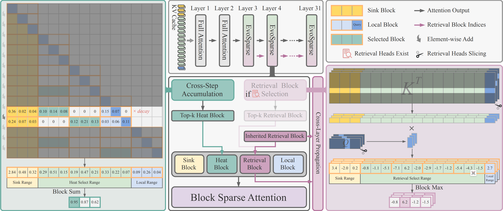

# `Evolving Sparsity: Leveraging Token Importance Dynamics for Efficient LLM Decoding with Sparse Attention`

> `Dynamic sparse attention that evolves across steps and layers to deliver high-performance, low-latency long-context LLM inference.`

## Authors

**Ruizi Han**1, 2, **Miao Zhang**1\*, **Ziyue Qiao**2\*, **Liqiang Nie**1

1 `Harbin Institute of Technology (Shenzhen)`  
2 `Great Bay University`  
\* Co-corresponding Authors

## Links
- **Code Repository**: [`GitHub`](https://github.com/iLearn-Lab/ACL26-EvoSparse)

---

## Table of Contents

- [Updates](#updates)
- [Method / Framework](#method--framework)
- [TODO](#todo)
- [License](#license)

---

## Updates

- [04/2026] Initial release
---

## Method / Framework

  
**Figure 1.** Overall framework of `EvoSparse`.

---

## TODO

- [ ] Complete the code repository

---

## License

This project is released under the Apache License 2.0.
